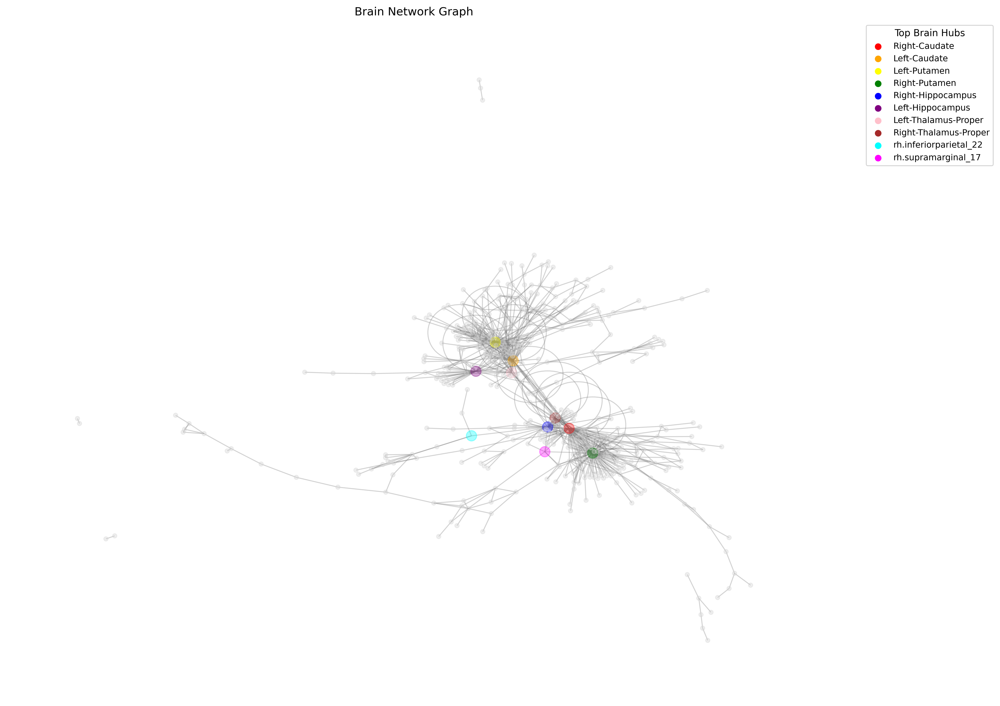
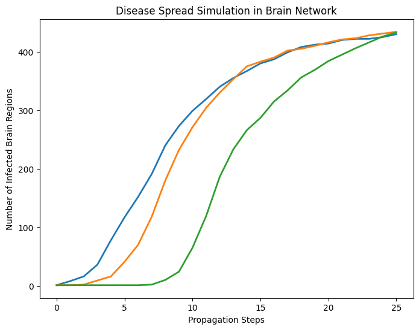
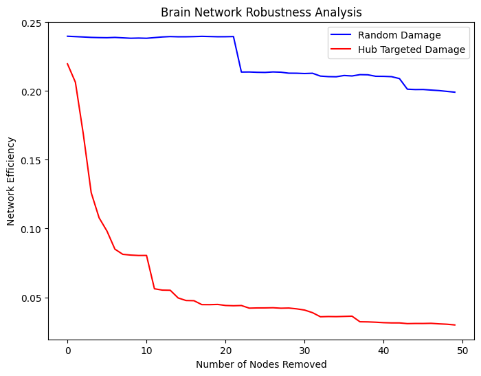
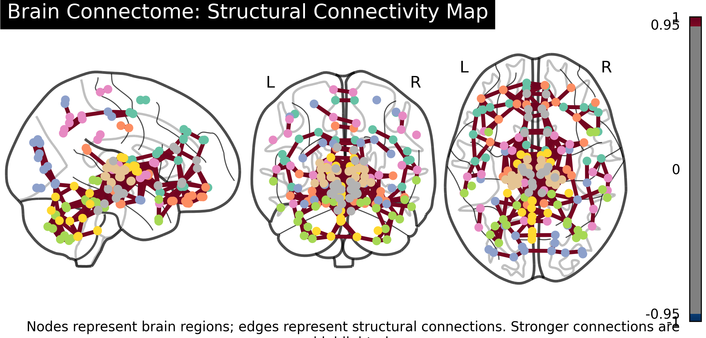

## Project Brain Twin
A computational model of brain networks that simulates disease propagation using graph theory and connectome-based analysis.

## Overview
This project models the human brain as a complex network and simulates disease progression using network perturbation and propagation techniques.
It serves as a foundational step toward building a Digital Brain Twin for studying neurological behaviour and disease dynamics.

## Project Preview
# Brain Network Structure
A graph-based representation where nodes correspond to brain regions and edges represent their connectivity.
  

Graph representation of brain regions and their connectivity.

# Network-Based Disease Propagation Simulation
Simulation of network-based disease propagation demonstrating how infection spreads across interconnected brain regions over time.

Disease spread across the brain network over multiple time steps.

# Network Damage Analysis
This visualization demonstrates how the removal of key brain regions affects overall network efficiency.

 
Impact of node removal on brain network efficiency.

## Anatomical Brain Mapping
This connectome visualization maps the brain network onto real anatomical brain views.
* Nodes : anatomical brain regions
* Edges : structural connectivity (connectome-based relationships)

Brain connectome showing anatomical mapping of network connectivity.

## Interactive 3D Simulation
An interactive 3D visualization of disease propagation in the brain network.
[View Interactive Simulation](https://decoding-with-sapna.github.io/brain-network/images/brain_simulation.html)

 Methodology
1. Data Loading
o Connectome dataset used to define brain connectivity
2. Graph Construction
o Nodes represent brain regions
o Edges represent connectivity (connectome-based relationships)
3. Network Analysis
o Centrality measures identify important brain regions
4. Perturbation Modelling
o Node removal simulates structural damage
5. Disease Spread Simulation
o Model’s propagation across the brain network

## Key Insights
* Certain brain regions act as hubs critical for maintaining network stability
* Targeted damage significantly disrupts network efficiency compared to random failures
* Disease spreads rapidly through highly connected regions

## Why This Matters
Understanding how diseases propagate through brain networks can help in:
* Early diagnosis of neurological disorders
* Identifying critical brain regions for intervention
* Advancing personalized medicine through digital brain twins

## Tech Stack
* Python
* NetworkX
* Pandas
* Matplotlib
* Plotly
* Nilearn

## Future Work
* Integration with real brain atlas (AAL, Nilearn)
* Weighted connectivity modelling
* Machine learning-based disease prediction
* Personalized brain network simulations

